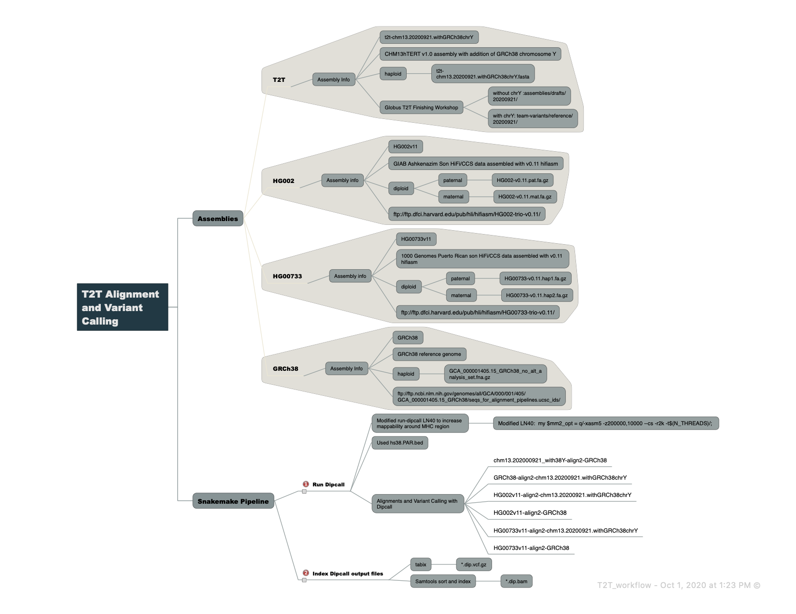

-------------------
GENERAL INFORMATION
-------------------

Title of Dataset: NIST alignment and variant calling for T2T Consortium.

Principal Investigator: Justin Zook, NIST, jzook@nist.gov

Dataset Contact(s): Justin Zook, NIST, jzook@nist.gov and Jennifer McDaniel, jmcdani@nist.gov

--------------------------
SUMMARY
--------------------------

NIST participated in the Telomere-to-Telomere (T2T) Consortium chm13-variant group. 
This group analyzed if the CHM13hTERT reference produced by the consortium has advantages 
a reference for variant calling.  NIST performed alignment and variant calling using Dipcall. 
The different alignments that were performed are described in the diagram below (T2T_workflow.png_). 

--------------------
DATA & FILE OVERVIEW
--------------------
### Description of files and outputs from Snakemake pipeline

- Snakemake code to run pipeline: `Snakefile`

- Configuration file for snakemake pipeline pointing to sample sheet and Dipcall PAR file : `config.yaml`

- Sample file for snakemake pipeline contains paths to assemblies (fasta) and  reference files used for Dipcall. Inputs listed in the sample file can be found at the locations noted in T2T_workflow.png: `samples_ALLruns.tsv`

- Output files can be found at Globus T2T Finishing Workshop /team-variants/assembly_aligns/dipcall/  Outputs used for analysis include: *.dip.vcf.gz, *.dip.bed, *.hap1.bam and *.hap2.bam. If assembly was haploid, the haploid assembly would be used for both paternal and maternal haplotypes as input for dipcall. In this case only one hap.bam is needed as hap1.bam and hap2.bam would be the same. 

- Directory contains source code for Dipcall: `src/`

	- `run-dipcall` contains modified LN40
	
	- `run-dipcall-original` contains original Dipcall parameters

--------------------------
METHODOLOGICAL INFORMATION
--------------------------
Variants were first called using the dipcall assembly variant calling pipeline (https://github.com/lh3/dipcall, PMID:30013044). Briefly, dipcall first aligns an assembly to a reference genome, as described in diagram above. We used optimized alignment parameters -z200000,10000 to improve alignment contiguity, as previously shown to improve variant recall in regions with dense variation like the Major Histocompatibility Complex (https://doi.org/10.1101/831792). Dipcall uses the resulting alignment to generate a bed file with haplotype coverage and call variants.

## Snakemake Pipeline Information

To generate alignment and variant call output with Dipcall a Snakemake pipeline was used. 

### Pipeline Dependencies
- Snakemake >v5.18
- Docker
- Dipcall found in `src/` directory
  - Dipcall source code reterieved from https://github.com/lh3/dipcall
  - uses docker container for k8 binaries
  	- docker://jmcdani20/hap.py:v0.3.12 
  - Dipcall file LN 40 modified (my $mm2_opt = q/-xasm5 -z200000,10000 --cs -r2k -t$(N_THREADS)/;) 
    for better mapping to MHC, all other parameters are original default parameters for Dipcall.
    More information on Dipcall modification can be found here: https://github.com/NCBI-Hackathons/TheHumanPangenome/tree/master/MHC/benchmark_variant_callset/MHCv1.0/assembly
